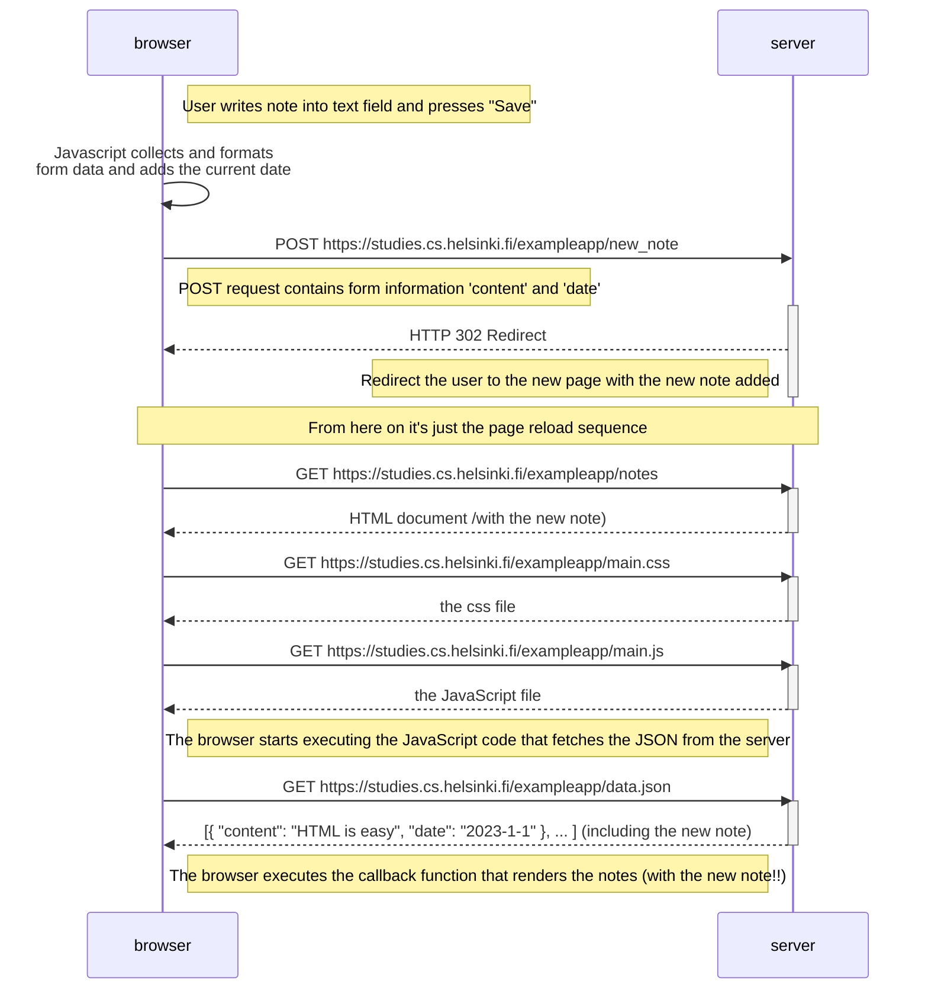

```mermaid
sequenceDiagram
    participant browser
    participant server
    
    Note right of browser: User writes note into text field and presses "Save"
    browser->>browser: Javascript collects and formats<br/>form data and adds the current date
    
    browser->>server: POST https://studies.cs.helsinki.fi/exampleapp/new_note
    Note right of browser: POST request contains form information 'content' and 'date'
    activate server
    server-->>browser: HTTP 302 Redirect
    Note left of server: Redirect the user to the new page with the new note added
    deactivate server
    
    Note over browser,server: From here on it's just the page reload sequence

    browser->>server: GET https://studies.cs.helsinki.fi/exampleapp/notes
    activate server
    server-->>browser: HTML document /with the new note)
    deactivate server

    browser->>server: GET https://studies.cs.helsinki.fi/exampleapp/main.css
    activate server
    server-->>browser: the css file
    deactivate server

    browser->>server: GET https://studies.cs.helsinki.fi/exampleapp/main.js
    activate server
    server-->>browser: the JavaScript file
    deactivate server

    Note right of browser: The browser starts executing the JavaScript code that fetches the JSON from the server

    browser->>server: GET https://studies.cs.helsinki.fi/exampleapp/data.json
    activate server
    server-->>browser: [{ "content": "HTML is easy", "date": "2023-1-1" }, ... ] (including the new note)
    deactivate server

    Note right of browser: The browser executes the callback function that renders the notes (with the new note!!)
```