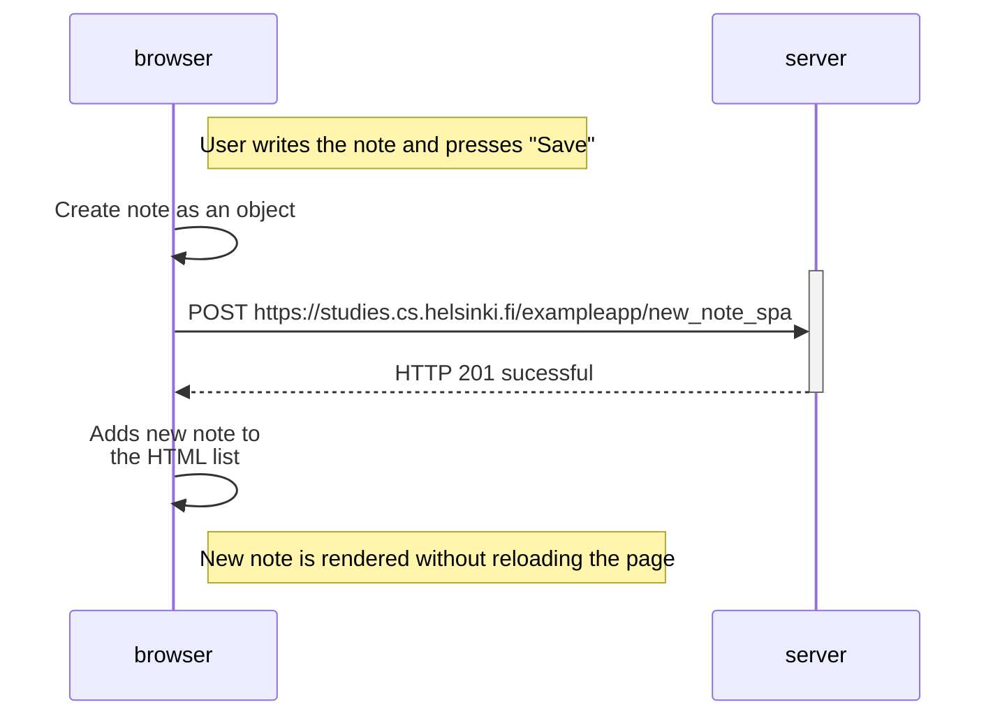

```mermaid
sequenceDiagram
    participant browser
    participant server
    
    Note right of browser: User writes the note and presses "Save"
    
    browser->>browser: Create note as an object
    
    activate server
    browser->>server: POST https://studies.cs.helsinki.fi/exampleapp/new_note_spa
    server-->>browser: HTTP 201 sucessful
    deactivate server
    
    browser->>browser: Adds new note to<br/>the HTML list 
    Note right of browser: New note is rendered without reloading the page
```